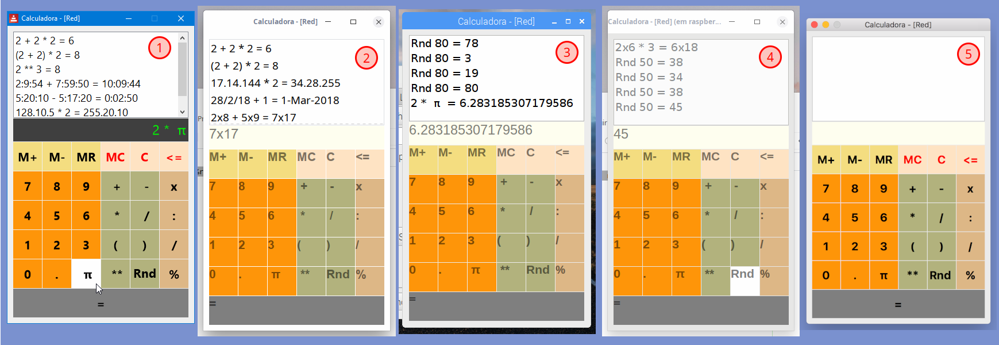

# rcalc
Uma calculadora simples em Red.

## Screenshot
Como uma imagem vale por mil palavras ....

1. Programa rodando no Windows 10
2. Programa rodando no Linux (Deepin x64)
3. Programa rodando no Raspberry Pi (raspbian)
4. Programa rodando no RPi via SSH (Linux)
5. Programa rodando no MacOS (cedida por: [R cqls](https://github.com/rcqls))
6. Só esperando o Red para Android (ainda vai demorar um pouco)

## Instruções

Atualmente não aceita entrada pelo teclado, somente mouse
- __9,8,7,6,5,4,3,2,1__ e __0__ : Entrada de valores numéricos
- __.(ponto)__ : informação do ponto decimal (também pode ser utilizado para tuplas)
- __+, -, *__ e __/__ : entrada das quatro operações para efetuar os cálculos
- __(__ e __)__ : defini a prioridade das operações
- __=__ : efetua o cálculo e coloca na lista superior
- __M+__ e __M-__ : adiciona ou subtrai o vlor do visor da memória (se for um cálculo, será avaliado antes)
- __MC__ : limpara o valor da memória (zera)
- __C__ : limpa o valor do visor; se pressionado novamente, limpa a lista superior
- __<=__ : apaga o último valor digitado
- __Rnd__ : retorna um número aleatório entre 1 e o próximo valor no visor
- __π__ : insere o valor de pi (3.14159...)
- __X__ (direita) : indicação de par ordenado (4x6)
- __:__ (direita) : separador de hora (hh:mm[:ss])
- __/__ (direita) : separador de data (dd/mm/aa[aa])
- __%__ (direita) : indicador de percentual (20% -> 0.2)
- __lista superior__ : clicando na lista superior, a entrada sem o resultado será copiada para o visor)

## Exemplos de cálculos

Nas imagens acima é possível ver alguns exemplos de cálculos.

## Post no Wordpress

Se você deseja comentar ou outras informações, pode dar uma passada no [wordpress](https://fotomix.wordpress.com/2019/03/31/calculadora-red-gui-o-mais-dificil-e-saber-quando-parar/).

## Para fazer

São tantas ideias que nem é possível listar. A próxima etapa será permitir a entrada pelo teclado (número, ponto, calcular resultado e limpeza da tela). 
